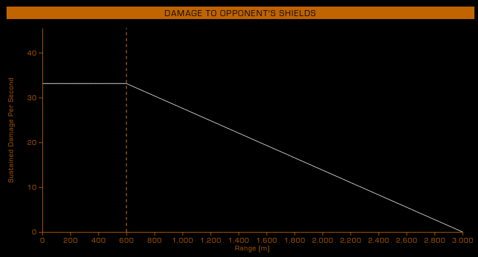

# Damage

## Damage Falloff

Beyond this range, the actual damage dealt is interpolated between the maximum damage at the falloff start, down to zero damage at the weapons maximum range

This is most relevant on hitscan weaponry. Most projectile weapons are unlikely to hit beyond their falloff range. For hitscan weapons, the long range mod will completely remove any falloff while doubling the range.

{.image-with-caption}

Stock Beam Laser damage falloff demonstrated through the profiles view in [:material-link: Coriolis](https://coriolis.io)
{.caption}

## Piercing vs. Hardness

* Weapons piercing value: Different per weapon type and size. Generally bigger weapons have higher piercing stat.
* Hull hardness stat: Generally bigger ships have higher hardness stat. Ships meant for combat usually have higher hardness stat.
* When striking hull:
    * Weapon piercing > hull hardness: Full damage is dealt
    * Weapon piercing < hull hardness: Damage is multiplied (reduced) by the ratio of piercing against hardness
* [:material-link: E:D Shipyard](https://edsy.org) and [:material-link: Coriolis](https://coriolis.io) list piercing values for all weapons and hardness values for all hulls
* If the hull hit is affected by the corrosive debuff, incoming weapon damage is calculated with the piercing value increased by 20 points.

## Breaching (Internal module damage)

* Each weapon has a maximum and minimum breach chance.
* Whenever a weapon hits hull, a breach roll occurs against breach chance interpolated by the hull integrity (not hull health! Refer to [:material-information-outline: Hull Integrity](./general.md#hull-integrity))
* If the breach roll succeeds, the incoming damage is multiplied by the hull resistances
* When breaching:
    * A ray across the projectiles movement direction is traced through the ship
    * The first module hit by this ray is damaged (module reinforcement packages may reduce damage further)
* The *Super Penetrator* experimental effect allows the breach ray to hit and damage multiple modules

