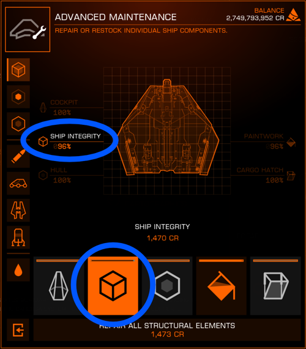

# General

## Ship Integrity

* Besides the hull health (affected by armor and modules), ships have a hidden "ship integrity" stat
* Slowly degrades over time
* Quickly degrades when taking hull damage (roughly 75% hull health lost ⇒ ship integrity reaches 0%)
* The lower the ship integrity, the higher the chance of damage to internal modules from incoming weapon fire (see [:material-information-outline: Breaching](./damage.md#breaching-internal-module-damage))
* Must be manually repaired at a station with the *Repair* service in the *Advanced Maintenance* section

{.image-with-caption}

## Magazines

* All ammo-fed weapons draw from a magazine
* Magazines cannot be reloaded or discarded manually
* Magazines are replenished from the ammo pool once empty
* The *Auto Loader* experimental effect (Multicannons, Cannons) continuously replenishes the magazine from the ammo reserve pool
