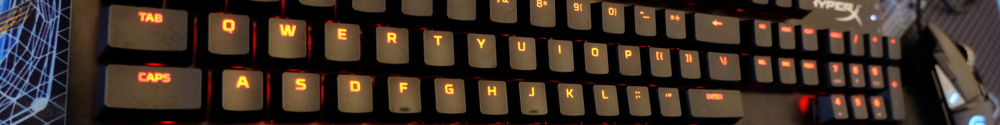
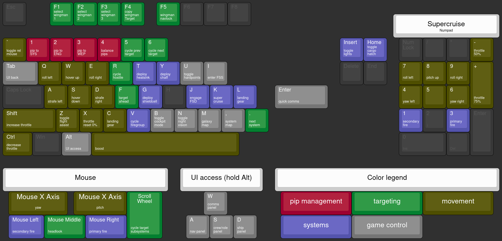

{loading=lazy}
{: .banner }

# Improved Preset for Mouse & Keyboard
## Installing the Controls Preset
### 1. Download the controls file
Go either route:

*   The default preset file [:material-file-download: Brains KB+M Binds v1.1](../files/Brains KB+M Binds v1.1.4.0.binds), easiest and quickest to set up
*   The pip macro preset file [:material-file-download: Brains KB+M Macro Binds v1.1](../files/Brains KB+M Macro Binds v1.1.4.0.binds), intended to work with an AHK macro script: [:material-file-download: basicpipmacro.ahk](../files/basicpipmacro.ahk). This script requires [:material-link: AutoHotkey (Free, Open Source Software)](https://www.autohotkey.com/) to be executed (start the script when you start your game).
### 2. Navigate to the Bindings Folder

Navigate here:

```
%localappdata%\Frontier Developments\Elite Dangerous\Options\Bindings
```

Copy your controls preset file, and start up the game.

### 3. Select the Preset in the Game

Now in the **Options :material-arrow-right: Controls** menu, select the first entry in the list called Presets and switch to the Brains KB+M Binds Preset. Just hit Apply and you’re good to go.
    
### Notes

* Installing the controls file does not overwrite any existing controls
* You can change individual bindings as you would do with any normal binding preset.
* You can also rename the preset by opening the file in a text editor and changing the property `PresetName` and renaming the file itself to `<YourNameHere>.3.0.binds`. Make sure the name of the file is the same as the preset name, otherwise you will encounter issues saving your preset.
* The preset differs greatly from the standard layout (in good ways only, tho)


## Control Layout Diagram
[](../assets/keyboard-layout.png)
Image generated with use of the [:material-link: Keyboard Layout Editor](http://www.keyboard-layout-editor.com/)
{: .hint }

## Explanations

* The binds on the numpad are intended for supercruise.
* What is wrong with the Standard Presets?
    * Pip Management is on the arrow keys, and with how important it is for efficient use of ship capabilities and resources, this is way out of reach in normal use.
    * Little emphasis is put on lateral and vertical thrusters, despite these being really important for efficient maneuvering