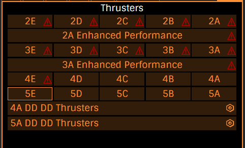
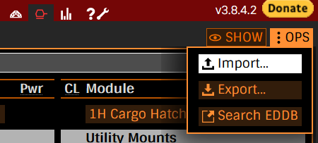

{loading=lazy}
{: .banner }

# E:D Shipyard Module Presets
## What are Module Presets?

Module presets in EDSY allow you to add an engineered module into a slot of your build with just one click. The presets provided here aim to make building ships in EDSY quicker by providing the most commonly used engineering combinations, without cluttering the module list by adding excessive amount of presets.



## Basic Module Presets

1. Copy everything from this text file [:material-text-long: edsymodulepresets.json](../files/edsymodulepresets.json) into your clipboard
1. Open [:material-link: E:D Shipyard](https://edsy.org/) in your browser of choice
1. Go into the **Outfitting** Tab
1. Click the **Import** Button (Part of the OPS Menu)

    

1. Paste in the JSON formatted data from the clipboard and click **Okay**
1. Make sure “Also store preferences” is enabled. This action will not overwrite/delete any existing builds, but may overwrite existing similarly named module presets. Click **Okay**
1. Reload EDSY. If reload fails, restart the browser too. You should now see all available module presets.

### Included Modules

- **Lightweight Bulkheads**: Heavy Duty - Deep Plating
- **Milgrade Bulkheads**: Heavy Duty - Deep Plating, Lightweight  - Deep Plating
- **Reactive Bulkheads**: Heavy Duty - Deep Plating, Lightweight  - Deep Plating, Thermal Resistant  - Deep Plating
- **All A-rated Powerplants**: Armoured - Monstered
- **All A-rated Thrusters class 4+**: Dirty Drives - Drag Drives
- **All A-rated FSDs**: Increased Range - Mass Manager
- **All Life Support classes**: D-rated Lightweight, A-rated Lightweight
- **All A-rated Power Distributors**: Charge Enhanced - Super Conduits
- **All D-rated Sensors**: Long Range, Lightweight
- **Chaff, Heatsink**: Ammo Capacity
- **A-rated Shield Boosters**: Heavy Duty - Super Capacitors, Resistance Augmented - Super Capacitors, Thermal Resistant - Super Capacitors
- **E-rated Shield Boosters**: Heavy Duty - Super Capacitors, Resistance Augmented - Super Capacitors
- **1A FSD Interdictor**: Expanded Capture Arc
- **All D-rated Hull Reinforcement Packages**: Heavy Duty - Deep Plating
- **Bi-Weaves classes 2+**: Thermal Resistant - (No experimental)
- **Prismatics classes 3+**: Reinforced - High Cap
- **Detailed Surface Scanner**: Expanded Radius

## How to add new Module Presets

1. Configure the module with engineering blueprint and experimental
1. Click the ➕ Symbol above the module info.
1. Enter a name in the prompt. Note that the name is unique across all locally available module presets. If no prompt appears, make sure EDSY has the permission to create prompts.
1. Done. Here is what the Icons do:
    - 🔃: Reset the current module to the preset
    - 💾: Save the changes you made to the module to the preset
    - ➕: Save as new preset
    - 🅰️: Rename the preset
    - 🗑️: Delete the preset

## How to export your Module Presets 

1. Navigate to the **Help** tab
1. Click the **Backup All Data** Button
1. The returned text follows a JSON Data format. You can manually edit it and delete the builds, modules (presets) or options section. Note that the format and version fields are required in order for EDSY to import the data.	

    ```json
    {
      "format": "edsy",
      "version": 35341,
      "builds": {},
      "modules": {},
      "options": {}
    }
    ```