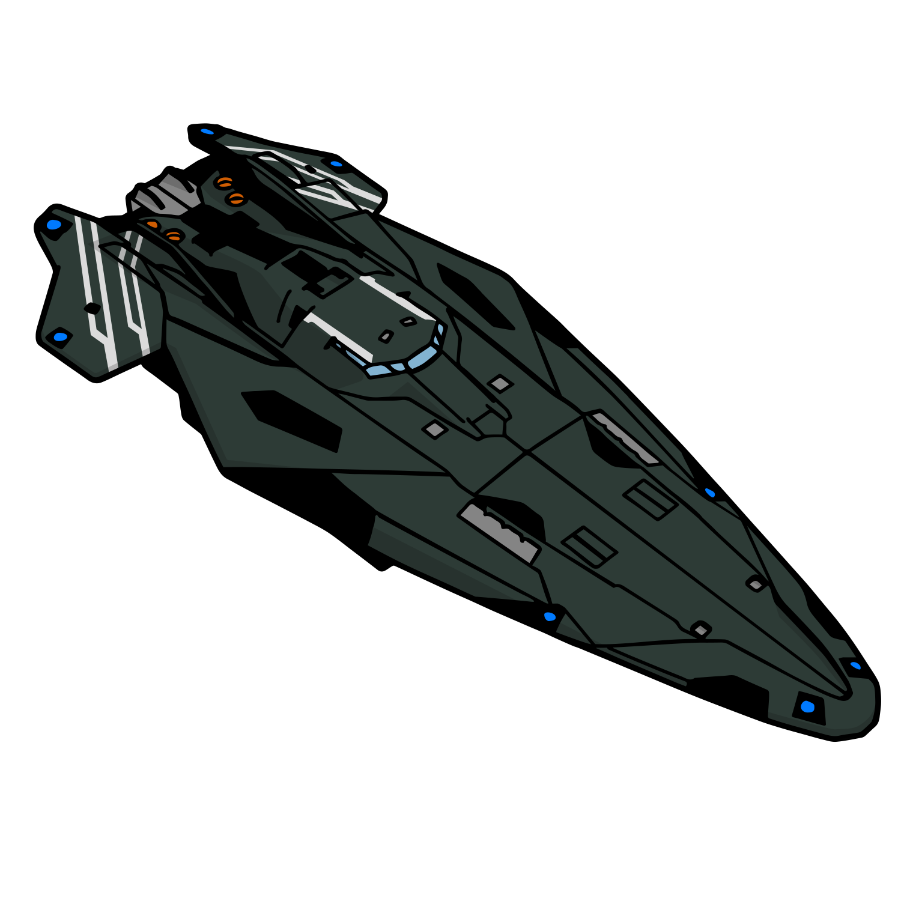

# Anaconda
{.detailsShipImage}

|Build|Cost|Links||
|:-|:-|:-|:-|
|:material-hexagon: Basic|397M Cr|[:material-link: E:D Shipyard](https://edsy.org/#/L=F600000H4C0S80,HhR00HgB00HgB00HgB00FCg00FCg00FBG00FBG00,DBw00DBw00DBw00DBw00DBw00Cjw00Cjw00Cjw00,9p300ADI00ARM00AfQ00Aty00BBo00BRu00Bcg00,16y00,7WC007jw007jw007jw0016y0016y0016y0023u0023u0015O0012G0010i00,PvE_0Combat_0_D_0Basic){target=_blank}|[:material-link: Coriolis](https://coriolis.io/outfit/anaconda?code=A0putpFklndzsxf57o7l7l7l1a1a17170404040404020202B05n5n5n2d2dm92dm72b2b2725.AwRj4yumg%3D%3D%3D.Aw18ZXEA..EweloBhBmSQUwIYHMA28QgIwVyKBQA%3D%3D&bn=PvE%20Combat%20-%20Basic){target=_blank}|
|:material-hexagon-multiple: Full Engi|388M Cr|[:material-link: E:D Shipyard](https://edsy.org/#/L=G600000H4C0SC0,HhRG0BM_W0HgBG0BM_W0HgBG0BM_W0HgBG0BM_W0KZyG07M_W0KZyG07M_W0HdhG05K_W0HdhG05I_W0,DCYG09L_W0DBwG09L_W0DBwG0BL_W0DBwG0BL_W0DBwG05L_W0DBwG05L_W0DBwG05L_W0DBwG05L_W0,9p3G05I_W0ADIG03I_W0ARMG05I_W0AfQG05J_W0Aty00BBoG03L_W0BRuG05G_W0Bcg00,16yG05I_W0,7WCG07I_W07jwG054_W07jwG054_W07jwO054_W016yG05I_W016yG05I_W025S0023u0015OG05I_W015OG05I_W012GG05I_W010iG05I_W0,PvE_0Combat_0_D_0Full_0Engi){target=_blank}|[:material-link: Coriolis](https://coriolis.io/outfit/anaconda?code=A0putpFklndzsxf57o7l7l7l2a2a24240804040404040404B05n5n5n2d2d2d2dm7m72b2725.AwRj4ys1pI%3D%3D.Aw18ZXEA.H4sIAAAAAAAAA43TK0yCURQH8MNT3vB98vh4K3zKRmBUis3JnG4UJ9ViMBF0MxAw2EzOmQwEo8GmgZGsbBY2g3NGu8w5xXs8h8GdEOQSzv7j%2FnZf534gFgDgx0FleE7F27EC%2BFs%2BAK1OSb%2F3ApgDCwBaxJqUTSqu2jdi8LUEEL21k3ykidAqohIdUgmaX4jhDMlIOwhgsMw3YiRtIiHl8USOlgs3IySfaQQdoiLRCRW3TyB6LjSAZU45TiucVjmhU%2BxNuB4qAJSqA8T4VpqGXKIuZ6LDgZ2Xc9STAM4bP%2B1ptJxbBXlUkFcF%2BcSuRPtUijUY3%2Fjo9HE%2BAvpVUEDsSGSjAvyvnYvOl21wb9LGEKlhf6TrXxkSG1Je8cu4dlKXuOkaJ%2BPBTS%2BDE2rKUhfVadmg3mlczDMPjS%2FOGQ%2BL9anxIF%2BBXj4aL5J9ChCKqKCoCoqpIENsS3RAxcq35%2BSH7q1QL7QXKhGWZoe%2FkLjYZG5nfkrF0nqnrpQ%2FEUdzFt6I59sf1ICEskwqy5Qoys1e8gXfUQwspWifnHT%2BSE1OmFaWGWWZVZa5WdmVsislJ8zPyp6UPSk5oTkr%2B1L2peSECPN%2BvzEZqfM3BQAA.EweloBhBmSQUwIYHMA28QgIwVyKBQA%3D%3D&bn=PvE%20Combat%20-%20Full%20Engi){target=_blank}|
|||[:material-link: E:D Ship Anatomy](http://a.teall.info/edsa/?s=anaconda){target=_blank}|

The **Anaconda** is the one ship which in practice will dish out the most damage. What makes it unique are the hardpoints, which offer a nearly unrivaled convergence for the sheer quantity, backed by a class 8 distributor. This gives this ship a special niche among the big ships for endgame farm & fun machines. The downside of being such a large beast is a slow top speed, however apart from that the maneouvrability is still easy to handle for an experienced captain. The ship is a great shield tank.

**Unengineered** the ship will already tear through everything. Only in rare situations such as POIs, Conflict Zones or signal sources with multiple engineered opponents would pose a challenge.

**Engineered** really needs nothing to say about. Nothing is a threat anymore at this stage.

Last updated: January 2022
{: .hint }

