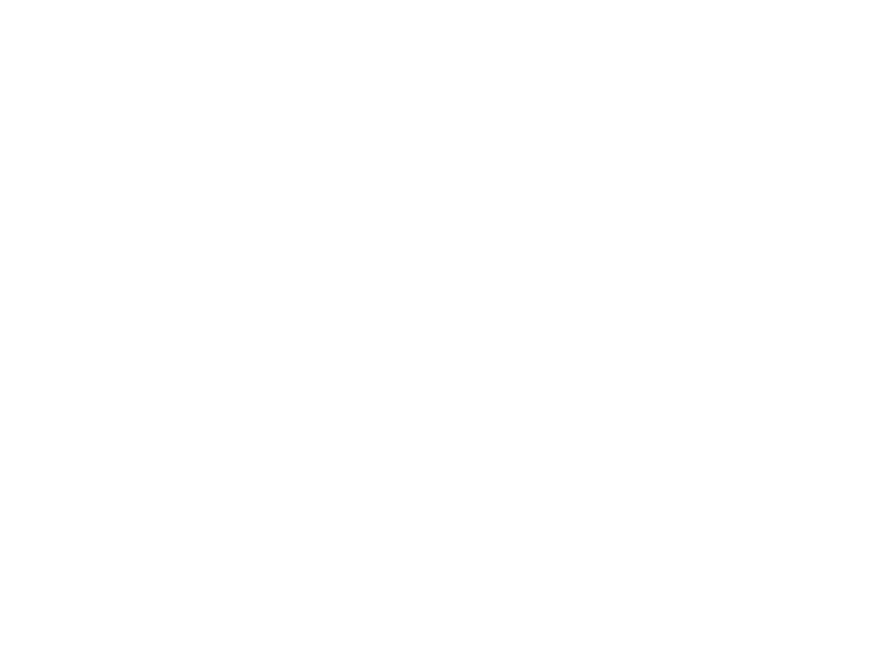

# Alliance Challenger
{.image250}

Hardpoint Configuration: [:material-link: E:D Ship Anatomy](https://siriuscorp.cc/edsa/?s=alliance-challenger){target=_blank, .bulletinLink}

A copy of the [:material-information-outline: Alliance Chieftain](./chieftain.md), but:

* Slightly less agile
* A little better survivability
* Slightly more firepower
* More expensive

Just as its brothers, unengineered builds are forced to tank with hull, while engineered shield tanking is an option.

## :material-hexagon: Basic Build **93.9M Cr**

[:material-link: E:D Shipyard](https://edsy.org/#/L=ID00000H4C0SC0,HgB00Hf500Hf500Hf500FBG00FBG00FBG00,DBw00DBw00DBw00CEg00,9on00AAA00APo00Adt00AtU00B8g00BLA00Bb600,15O0015O0015O00,7Ue007jw0022K0022K0020m0012G0010i00,PvE_0Combat_0_D_0Basic){target=_blank, .bulletinLink}
<!-- [:material-link: Coriolis](){target=_blank, .bulletinLink} -->

## :material-hexagon-multiple: Engineered Build **90.5M Cr**

[:material-link: E:D Shipyard](https://edsy.org/#/L=ID00000H4C0SC0,HgBG0BI_W0Hf5G0BM_W0Hf5G0BM_W0Hf5G0BM_W0KYiG07M_W0KYiG07M_W0KYiG07M_W0,DCYG09L_W0DCYG09L_W0DCYG09L_W0CEgG02G_W0,9on00AAAG03I_W0APoG05I_W0AdtG05J_W0Aty00B8gG03L_W0BLeG05G_W0Bb600,7wv007wv007wv00,7UeG09I_W07k4G054_W07vL007vL0020m0012GG05I_W010iG05I_W0,PvE_0Combat_0_D_0Full_0Engi){target=_blank, .bulletinLink}
<!-- [:material-link: Coriolis](){target=_blank, .bulletinLink} -->

Last updated: January 2025
{: .hint }
