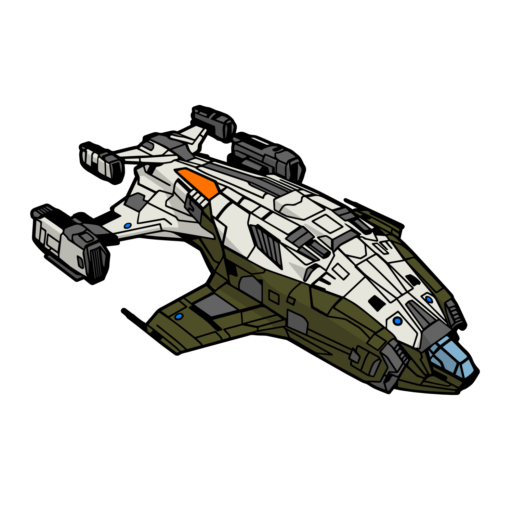

# Alliance Challenger
{.detailsShipImage}

|Build|Cost|Links||
|:-|:-|:-|:-|
|:material-hexagon: Basic|89.3M Cr|[:material-link: E:D Shipyard](https://edsy.org/#/L=GD00000H4C0S80,HgB00Hf500Hf500Hf500FBG00FBG00FBG00,DBw00DBw00DBw00CEg00,9on00AAA00APo00Ads00Aty00B8g00BLe00Bb600,15O0015O0015O00,7Ue007k40022K0022K0020m0012G0010i00,PvE_0Combat_0_D_0Basic){target=_blank}|[:material-link: Coriolis](){target=_blank}|
|:material-hexagon-multiple: Full Engi|89.4M Cr|[:material-link: E:D Shipyard](https://edsy.org/#/L=GD00000H4C0S80,HgBG0BI_W0Hf5G0BM_W0Hf5G0BM_W0Hf5G0BM_W0KYiG09M_W0KYiG09M_W0KYiG09M_W0,DCYG09L_W0DCYG09L_W0DCYG09L_W0CEgG02G_W0,9on00AAAG03I_W0APoG05I_W0AdsG05J_W60upD6upD8qpDE_PcGzcQKsPcAty00B8gG03L_W0BLeG05G_W0Bb600,7wv007wv007wv00,7Ue007k4G054_W07vL007vL0020m0012GG05I_W010iG05I_W0,PvE_0Combat_0_D_0Full_0Engi){target=_blank}|[:material-link: Coriolis](){target=_blank}|
|||[:material-link: E:D Ship Anatomy](http://a.teall.info/edsa/?s=alliance-challenger){target=_blank}|

The **Alliance Challenger** is a ship with a great mix of everything. It is reasonably maneouverable (The boost kicking after slightly longer delay than other ships takes some getting used to), but well flown it can get its large and well grouped armament on target consistently. Its base stats allow for building for both hull and shield tanking, giving it quite some staying power.

**Unengineered** it will easily deal with Hazardous RES and will also yield consistent results in low and medium conflict zones and regular combat missions.

**Engineered** this ship becomes a near invincible monster in PvE like most other ships in its class.

Last updated: January 2022
{: .hint }
