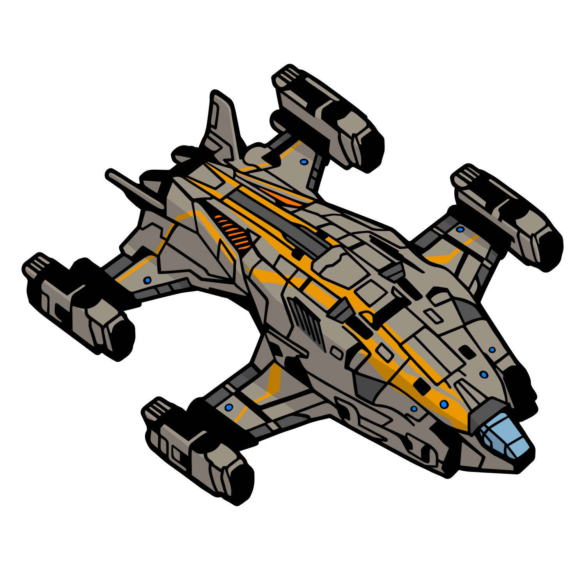

# Alliance Chieftain
{.image250}

Hardpoint Configuration: [:material-link: E:D Ship Anatomy](https://siriuscorp.cc/edsa/?s=alliance-chieftain){target=_blank, .bulletinLink}

A cost-effective powerful medium-pad combat ship

* Great turnrates, decent boost, passable lateral/vertical thrusters
* Great hardpoint convergence

When unengineered the poor initial shield capacity makes shield cell banks ineffective, forcing a hull tank configuration. Engineering, particularly Guardian Shield Reinforcements allow shield tanking.

## :material-hexagon: Basic Build **81.6M Cr**

[:material-link: E:D Shipyard](https://edsy.org/#/L=H900000H4C0SC0,HgB00HgB00Hf500FBG00FBG00FBG00,DBw00DBw00DBw00CEg00,9on00AAA00APo00Ads00AtU00B8g00BLA00Bb600,15O0015O0015O00,7Ue0016y0023u0020m0020m0010i00,PvE_0Combat_0_D_0Basic){target=_blank, .bulletinLink}
[:material-link: Coriolis](https://coriolis.io/outfit/alliance_chieftain?code=A2pktkFflkdpsff47l7l2717171704040400B12dm7m3m32b2b2b25.AwRj4yso.CwBj4yso..EweloBhBGA2EoFMCGBzANokMK4fiIA%3D%3D&bn=PvE%20Combat%20-%20Basic){target=_blank, .bulletinLink}

## :material-hexagon-multiple: Engineered Build **81.0M Cr**

[:material-link: E:D Shipyard](https://edsy.org/#/L=H900000H4C0SC0,HgBG0BM_W0HgBG0BM_W0Hf5G0BI_W0KYiG07M_W0KYiG07M_W0KYiG07M_W0,DCYG09L_W0DCYG09L_W0DCYG09L_W0CEgG02G_W0,9onG05I_W0AAAG03I_W0APoG05I_W0AdsG05J_W0Aty00B8gG03L_W0BLeG05G_W0Bb600,7wv007wv007wv00,7UeG09L_W07iMG054_W07goG054_W020m0012GK05I_W010iG05I_W0,PvE_0Combat_0_D_0Full_0Engi){target=_blank, .bulletinLink}
[:material-link: Coriolis](https://coriolis.io/outfit/alliance_chieftain?code=A2pktkFflndpsif47l7l2729292908080800B15i5dm3271J1J1J25.AwRj4yso.CwBj4yso.H4sIAAAAAAAAA42SL0hDcRDHv%2Fvr3v69vbc%2FbnOKuqeDhWG1WBURWXPVYhMMBsPCDIJZxGRYMBqMBqNVsKwZjHaHiLo77x7bDxGF9wtfvnAf7u53d6ApAKOYyNeZSOouDGR6acDpiHNvU4A3DAEcojVDdkUS7U9m%2B7kFlG6iQj5KIg5TyUCHIrb3wVyYE7LYt4GykvWDaSEjVDXk0YT0yxW6RSGfJMIxWjXQsYiVJubkuQMsqFtUt6RuWR3HaXeCu7kG0NoYMle2ZiWUoI7JJJ9DVMvFOjNA%2FDojPfnlrCBQ8gcU%2BQ9K0Y6B9kSabYyH6X%2Bsot1xOgiUCQJlad1Al7rFq7hMVBfkqCvfW7JFdWwHJnOBSYd0WCM5EuA0P5597UWGwy5tmyT7umW9AkeTeP4V5GlT41GNn4iEeq9yVCvvzH7%2Bhiap999YjigwWaKmqXmhjT%2BIzc7XpLA6V1vw1HH1Nzkw5MCQ6pjx1%2FsGV0DBBz0DAAA%3D.EweloBhBGA2EoFMCGBzANokMK4fiIA%3D%3D&bn=PvE%20Combat%20-%20Basic){target=_blank, .bulletinLink}

Notes:
* Short range is a great alternative mod for the rail guns here. Requires better range management, but rewards with a lot more damage up to 1000m out.

Last updated: January 2022
{: .hint }