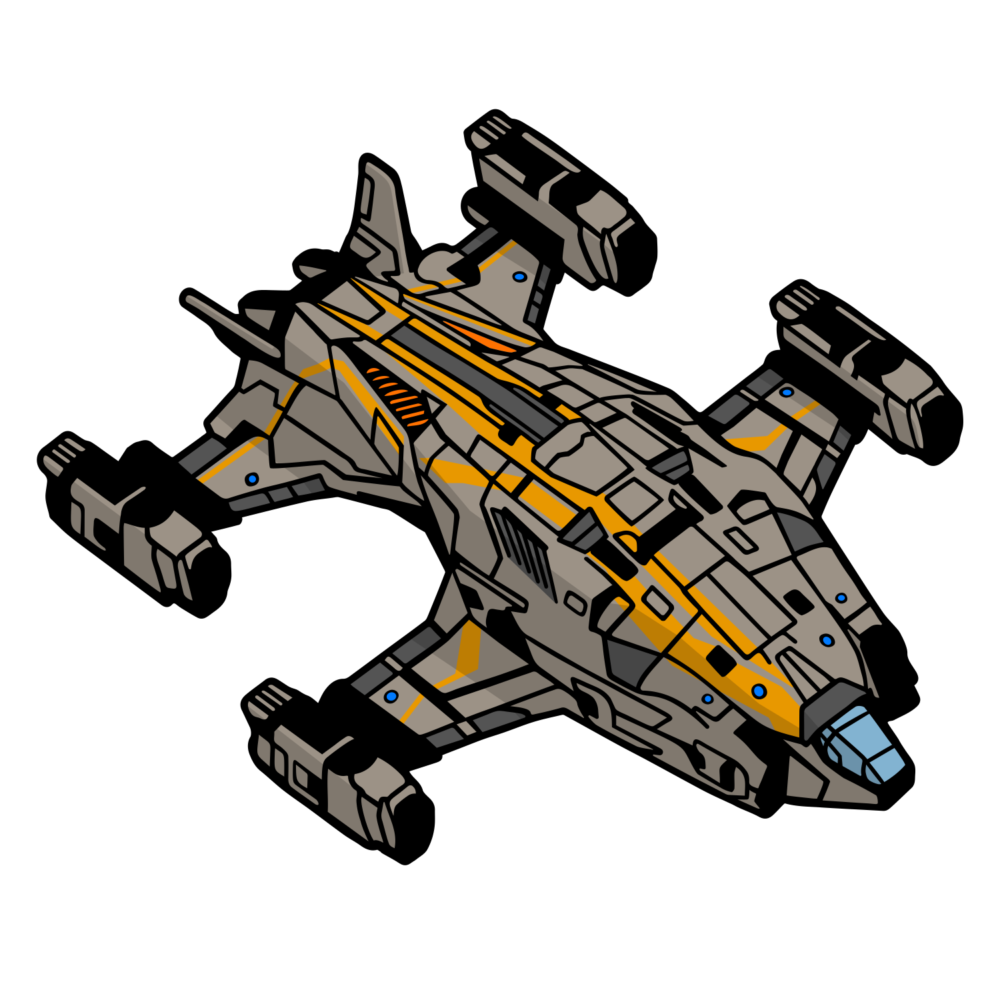

# Alliance Chieftain
{.detailsShipImage}

|Build|Cost|Links||
|:-|:-|:-|:-|
|:material-hexagon: Basic|81.2M Cr|[:material-link: E:D Shipyard](https://edsy.org/#/L=G90000057C0S00,HgB00HgB00Hf500FBG00FBG00FBG00,DBw00DBw00DBw00CEg00,9on00AAA00APo00Ads00AtU00B8g00BLe00Bb600,15O0015O0015O00,7Ue0016y0023u0020m0020m0010i00,PvE_0Combat_0_D_0Basic){target=_blank}|[:material-link: Coriolis](https://coriolis.io/outfit/alliance_chieftain?code=A2pktkFflndpsif47l7l2717171704040400B12dm7m3m32b2b2b25.Iw18RQ%3D%3D.Aw18RQ%3D%3D..EweloBhBGA2EoFMCGBzANokMK4fiIA%3D%3D&bn=PvE%20Combat%20-%20Basic){target=_blank}|
|:material-hexagon-multiple: Full Engi|81.0M Cr|[:material-link: E:D Shipyard](https://edsy.org/#/L=F900000H4C0SC0,HgBG0BM_W0HgBG0BM_W0Hf5G05I_W0KYiG07M_W0KYiG07M_W0KYiG07M_W0,DCYG09L_W0DCYG09L_W0DCYG09L_W0CEgG02G_W0,9onG05I_W0AAAG03I_W0APoG05I_W0AdsG05J_W0Aty00B8gG03L_W0BLeG05G_W0Bb600,7wv007wv007wv00,7UeG09L_W07iMG054_W07goG054_W020m0012GK05I_W010iG05I_W0,PvE_0Combat_0_D_0Full_0Engi){target=_blank}|[:material-link: Coriolis](https://coriolis.io/outfit/alliance_chieftain?code=A2pktkFflndpsif47l7l2729292908080800B15i5dm3271J1J1J25.AwRj4yso.CwBj4yso.H4sIAAAAAAAAA42SLUwDQRCFp%2FRa%2Bn%2B96w9taQnQgyYVDRaDhRBCagi1GBwJAoGoKIIETQgKUYFEIBFILAmmDoHE0xAC7QzzLu0KgrgTL28z383MzizxLBGNIyqjS5Xk4wxRupcicjrq3IckkTcMEUmINwzZVYm1f0TstxZR8d5S8kUTyQwXDXSiYnvfIvkFJQt9m6gEsn48p2SYK4Y8nZJ%2BuXy3oOSrRiTC6wY6U4mnWCRx5RAtwS3DrcCtwkmUD6a4m20QtbaGIuWdmoZi3DGZ9HJkoVykM08UvUtrT365eBAowXsGCqsQKlkQFxcrYQ610khEkrxvyEOVZpsmE%2FVvV8Y%2FkgoCpYNAGd400A1WeRvVsWJLDlzpKa6rhBM7MJkNTDqMiY39iVzkJguovutZXN41SY6wajwFB0k8%2FynkeBtxC%2FFzlVDvQ1%2FW2peIn7%2BBJPX%2Bp040H5gsctPUvEbjz2ozi1UtDOeiBQ9OKn%2FJgSEHhoQTof%2B%2BXyFuvCxCAwAA.EweloBhBGA2EoFMCGBzANokMK4fiIA%3D%3D&bn=PvE%20Combat%20-%20Full%20Engi){target=_blank}|
|||[:material-link: E:D Ship Anatomy](http://a.teall.info/edsa/?s=alliance-chieftain){target=_blank}|

The **Alliance Chieftain** is easy to fly with great turnrates, a decent boost and usable lateral/vertical thrusters. Its hardpoints are well positioned in one group with a medium hardpoint as the outlier. It has decent shields and can hulltank well.

**Unengineered** the chief will be able to deal with most things PvE combat has to offer. Only engineered opponents and being focus fired will pose a real threat.

**Engineered** the chief becomes near untouchable in any PvE situation. It can be built into a shield tank which will gives it enough buffer to take on the toughest opponents and enough sustain to keep on farming for hours on end. Offensively it offers easily enough to take on anything.

Last updated: January 2022
{: .hint }