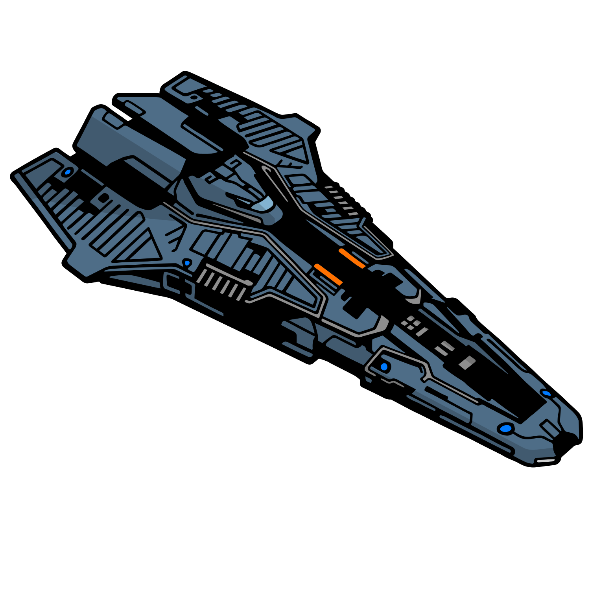

# Federal Corvette
{.detailsShipImage}

|Build|Cost|Links||
|:-|:-|:-|:-|
|:material-hexagon: Basic|448M Cr|[:material-link: E:D Shipyard](https://edsy.org/#/L=Gz00000H4C0S80,HhR00HhR00FEE00Hf500Hf500FBG00FBG00,DBw00DBw00DBw00DBw00DBw00DBw00Cjw00Cjw00,9p300ADI00ARM00AfQ00Aty00BBo00BRu00Bcg00,16y0016y00,7WC007lU007lU007jw807jw8016y0025S0023u0015O0022K0010i00,PvE_0Combat_0_D_0Basic){target=_blank}|[:material-link: Coriolis](https://coriolis.io/outfit/federal_corvette?code=A0putpFklndzsxf57o7o1d272717170404040404040202B05s5s5n5n2d2d2d2dm7m72925.AwRj4yo5Wo%3D%3D.Aw18ZVA%3D..EweloBhBmSQUwIYHMA28QgIwVyKBQA%3D%3D&bn=PvE%20Combat%20-%20Basic){target=_blank}|
|:material-hexagon-multiple: Full Engi|450M Cr|[:material-link: E:D Shipyard](https://edsy.org/#/L=Gz00000H4C0S80,HhRG0BM_W0HhRG0BM_W0EkgG07P_W0Hf5G0BM_W0Hf5G0BM_W0FBGG09J_W0HdhG05I_W0,DCYG09L_W0DBwG09L_W0DBwG0BL_W0DBwG0BL_W0DBwG05L_W0DBwG05L_W0DBwG05L_W0DBwG05L_W0,9p3G05I_W0ADIG03I_W0ARMG05I_W0AfQG05J_W0Aty00BBoG03L_W0BRuG05G_W0Bcg00,16yG05I_W016yG05I_W0,7WCG07I_W07lUG054_W07lUG054_W07jwO054_W07jwO054_W016yG05I_W016yG05I_W023u0023u0013qG05I_W010iG05I_W0,PvE_0Combat_0_D_0Full_0Engi){target=_blank}|[:material-link: Coriolis](https://s.orbis.zone/i3-_){target=_blank}|
|||[:material-link: E:D Ship Anatomy](http://a.teall.info/edsa/?s=federal-corvette){target=_blank}|

The **Federal Corvette** attracts with its looks alone. The flight model is quite easy to manage for a large ship, with a forgiving pitch and decent lateral, vertical thrusters. It offers two huge hardpoints right next to each other which makes for some interesting weapon options. Unfortunately the remainder of the hardpoints is spread all across the ship, making the ship unsuitable for a majority fixed weaponry loadout. The ship offers exceptionally great shielding with large optionals for shield cell banks.

**Unengineered** this ship will just like other ships in its class dominate near effortlessly.

**Engineered** this ship is straight up overpowered for PvE (as any other in its class).

Last updated: January 2022
{: .hint }
