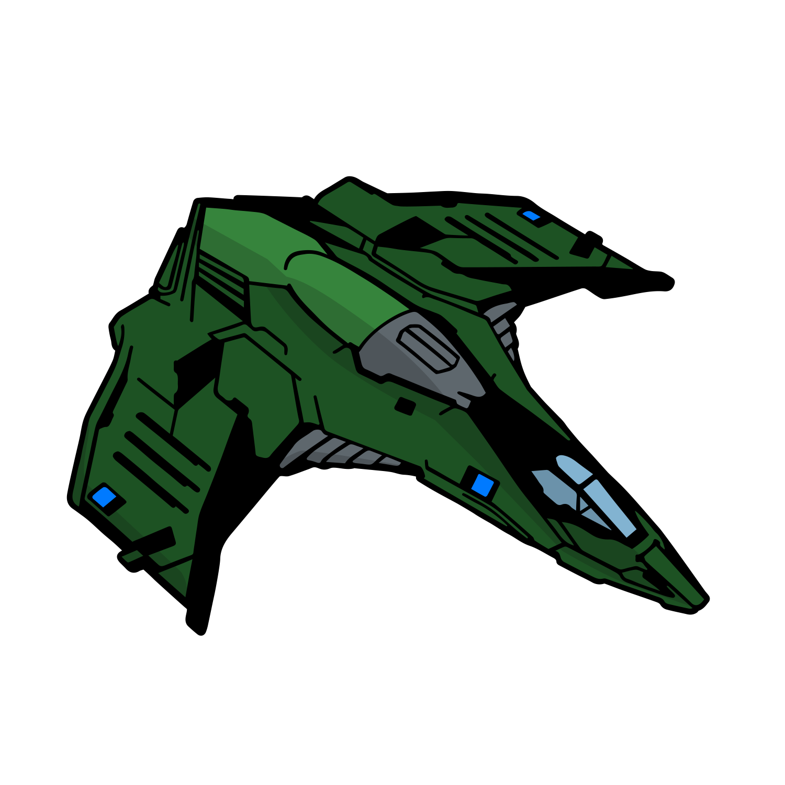

# Eagle Mk. II
{.image250}

Hardpoint Configuration: [:material-link: E:D Ship Anatomy](https://siriuscorp.cc/edsa/?s=eagle){target=_blank, .bulletinLink}

Cheaper fully kitted out than the [:material-information-outline: Viper Mk III](./viper3.md), and:

* slightly more agile
* significantly less survivability
* weak offense

Unengineered builds are forced into hulltanking.

## :material-hexagon: Basic Build **1.77M Cr**

[:material-link: E:D Shipyard](https://edsy.org/#/L=IL00000H4C0SC0,Hdh00Hdh00FBG00,CEg00,9on00A3w00AL600Aal00AnE00B2Q00BI200BX_00,12G00,7Py0012G0010i0010i001-C001-C00,PvE_0Combat_0_D_0Basic){target=_blank, .bulletinLink}
<!-- [:material-link: Coriolis](https://coriolis.io/outfit/eagle?code=A2p0t5F5l0d5s5f224241700B427272525m1m1.AwRj4zyA.CwBj4zyA..EweloBhAWEoUwIYHMA28QgIwV3fEQA%3D%3D&bn=PvE%20Combat%20-%20Basic){target=_blank, .bulletinLink} -->

Last updated: January 2025
{: .hint }