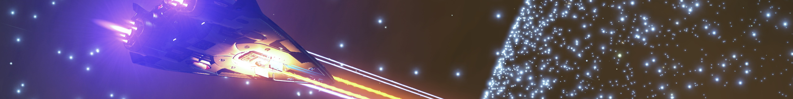
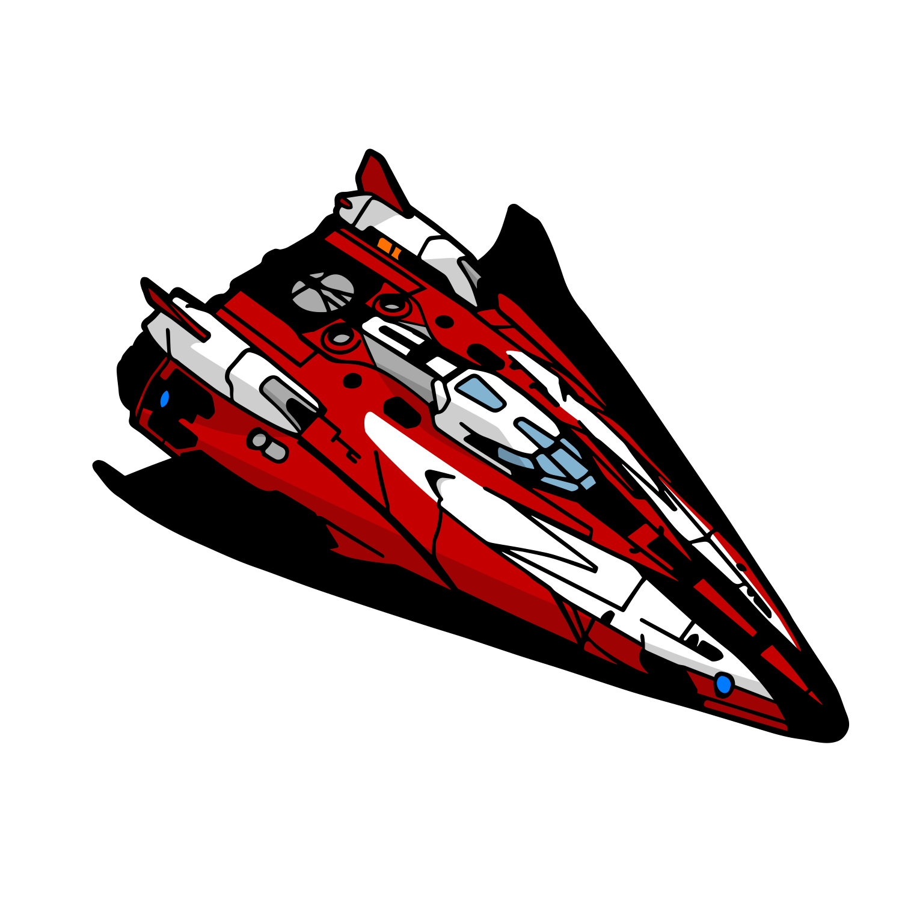

{.banner loading=lazy }

# Fer-de-Lance
{.detailsShipImage}

|Build|Cost|Links||
|:-|:-|:-|:-|
|:material-hexagon: Basic|131M Cr|[:material-link: E:D Shipyard](https://edsy.org/#/L=GO00000H4C0S00,HhR00Hf500Hf500FCg00FCg00,DBw00DBw00DBw00DBw00DBw00CEg00,9on00AAA00AOE00AcI00AsO00B8g00BLe00BZY00,,7T4007go007go0020m0010i0010i00,PvE_0combat_0_D_0Basic){target=_blank}|[:material-link: Coriolis](https://coriolis.io/outfit/fer_de_lance?code=A2pktfFalidpsif37o27271a1a040404040400B25d5dm32525.AwRj4yvI.Aw18WQ%3D%3D..EweloBhAOEoUwIYHMA28QgIwV3fEQA%3D%3D&bn=PvE%20Combat%20-%20Basic){target=_blank}|
|:material-hexagon-multiple: Full Engi|131M Cr|[:material-link: E:D Shipyard](https://edsy.org/#/L=GO00000H4C0S80,HhRG0BI_W0Hf5G0BM_W0Hf5G0BM_W0FCgG09J_W0FCgG09M_W0,DBwG09L_W0DBwG09L_W0DBwG09L_W0DBwG05L_W0DBwG05L_W0CEgG02G_W0,9onG05I_W0AAAG03K_W0AOEG05I_W0AcIG05J_W0AsO00B8gG03L_W0BLeG05G_W0BZY00,,7T4G09I_W07goG054_W07goG054_W020m0010iG05I_W010iG05I_W0,PvE_0combat_0_D_0Full_0Engi){target=_blank}|[:material-link: Coriolis](https://coriolis.io/outfit/fer_de_lance?code=A2pktfFalidpsif37o27271a1a040404040400B25d5dm32525.AwRj4yvI.Aw18WQ%3D%3D.H4sIAAAAAAAAA42SvUvDYBDGr21SkzZtmvQr1frZaKFD6eriJoqIdLOrq5ODgoNCOwjiKOLk0MHRwdHB0T%2FARXBwcHS3iKi98y60LxUsJMPD83K%2F9%2B5y7wFOAEBfZ%2Fk5Z0neRwFSbQvAabFz75IAfi8CQBFcUeQxi9H8JrJf6wCFW43JR05EUSwoaJ%2FF9r%2BIcjNM5rs2gCdkZa%2FIZAwnFXk4JINyuaM8ky8cIR2XFdRhMS0kSlw4APPiFsQtilsSR3HcGeJupgpQX%2B8RlTanOWRgS2WKsWhSTm9NAcRvUtxTUM4cgaxxUCIMlMRtBRkstSYMhhn8WEm6I2sEOhsHpXBNQVfyQNdxHpbM3hHnPZj8QOIoHZq0Q5MZXP1D2tKY2zgYQLPPaYacMJCLMqy%2BzB5Os4MHKr%2FxmbK4pe7vyn1ZFUfa8YNVyeGGxDWJn7BE2u%2B8eY1PoiB%2FVZJUuh%2FESxaaLGJN1byUETyxTc%2BVubA4V1rwxZEXmiT49%2FsFrVzDfmMDAAA%3D.EweloBhAOEoUwIYHMA28QgIwV3fEQA%3D%3D&bn=PvE%20Combat%20-%20Full%20Engi){target=_blank}|
|||[:material-link: E:D Ship Anatomy](http://a.teall.info/edsa/?s=fer-de-lance){target=_blank}|

The **Fer-De-Lance** is blessed with the best flight model of all medium ships. It has good lateral and vertical thrusters too boot, decent accelerations, and (what makes it so great) a very strong buff multiplier for boost. In addition it comes with very strong shields and great hardpoints. These properties make the FDL the de-factor meta PvP ship (Watch this [:material-link: Youtube Video](https://youtu.be/-ozUQFYWNMo) on how to build it for PvP). Small and few optional internals aswell as a poor jumprange prevent this ship from becoming the PvE meta. But for a pure killing machine this is definitely a perfect pick.

When **unengineered** the FDL will (as most other ships of its size class) deal easily with most standard opponents.

**Fully engineered** this ship will tear to shreds anything PvE could offer.

Last updated: January 2022
{: .hint }
