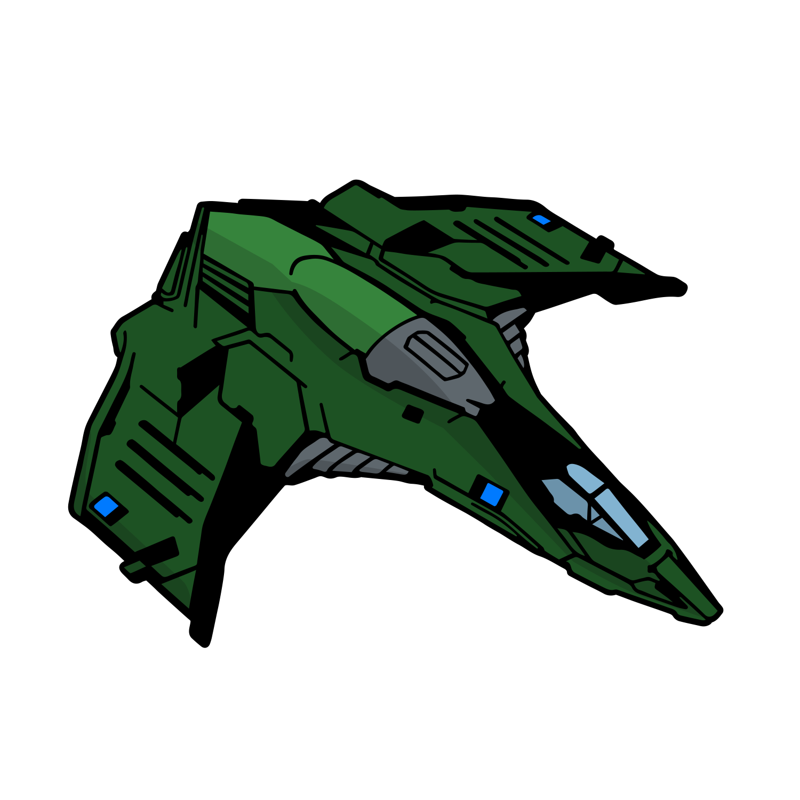
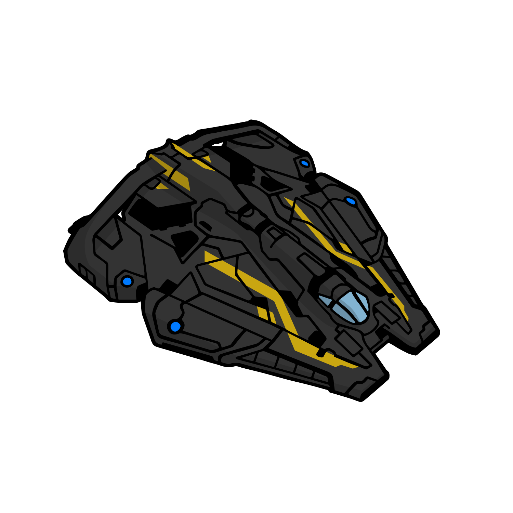
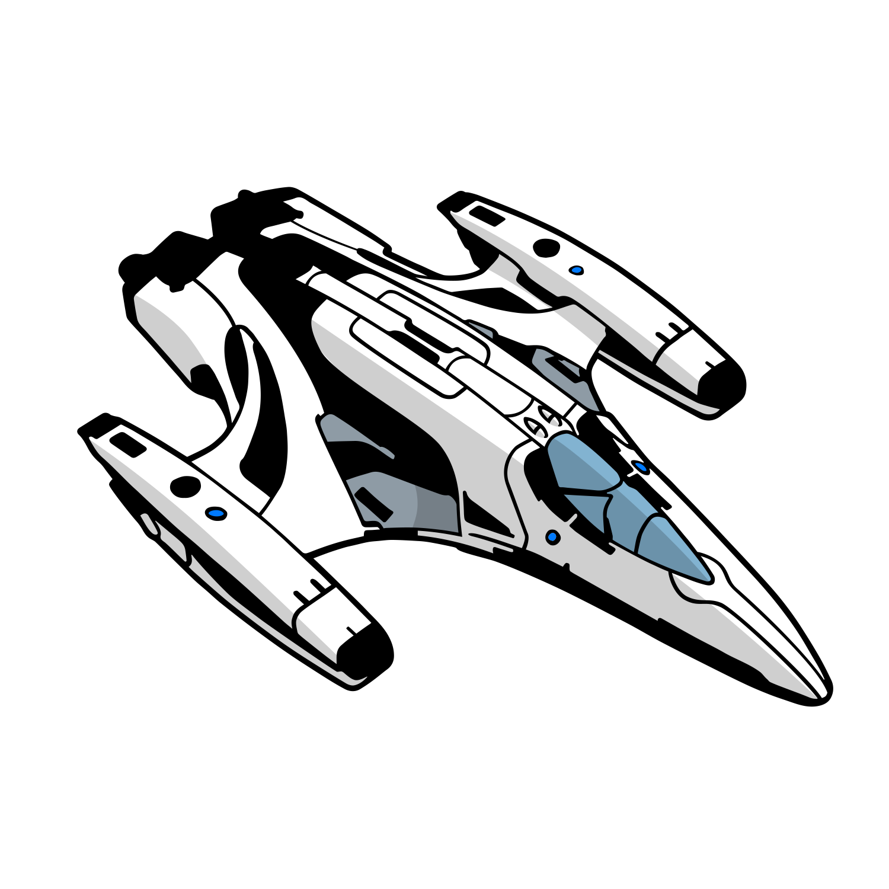
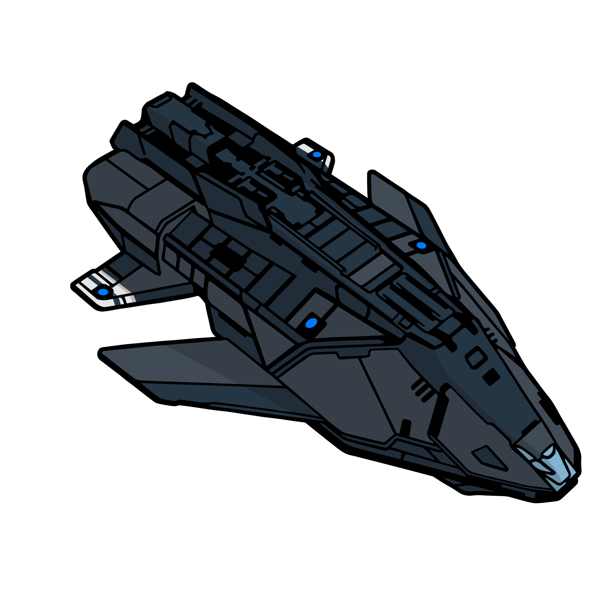
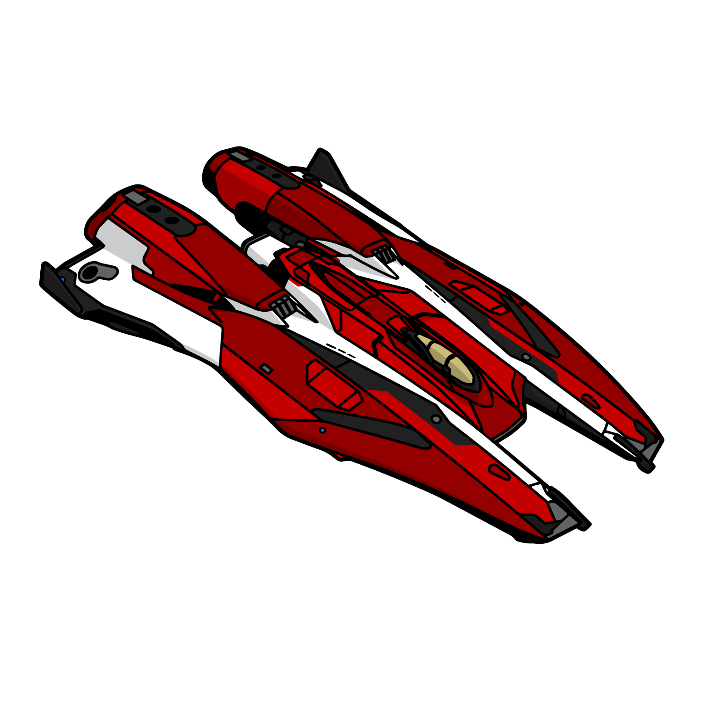
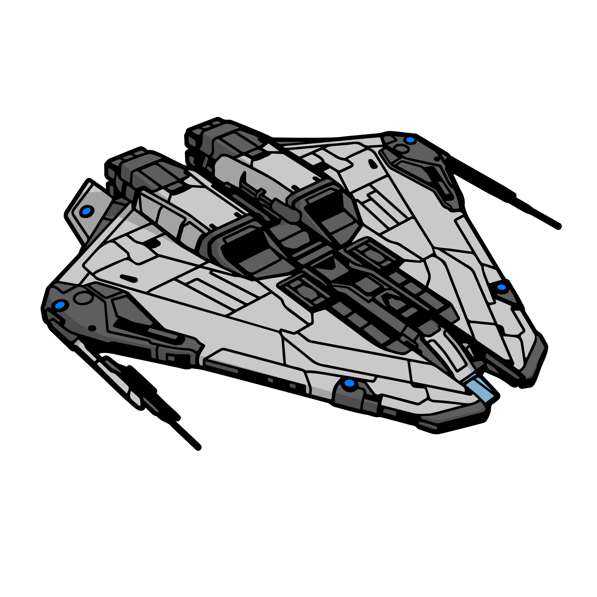
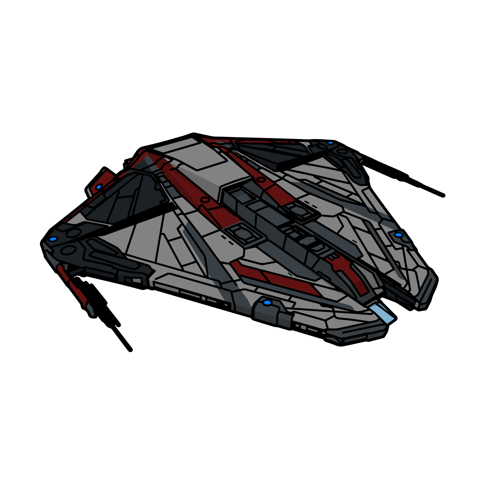
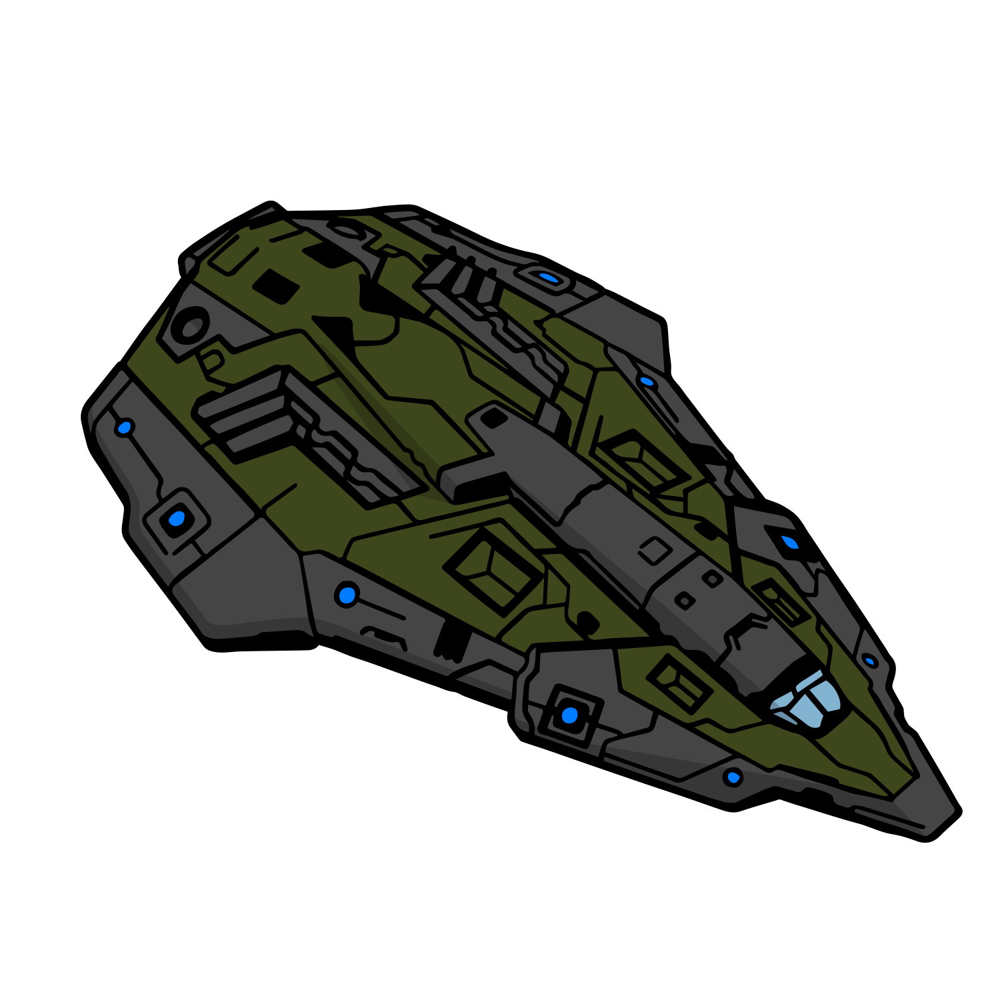
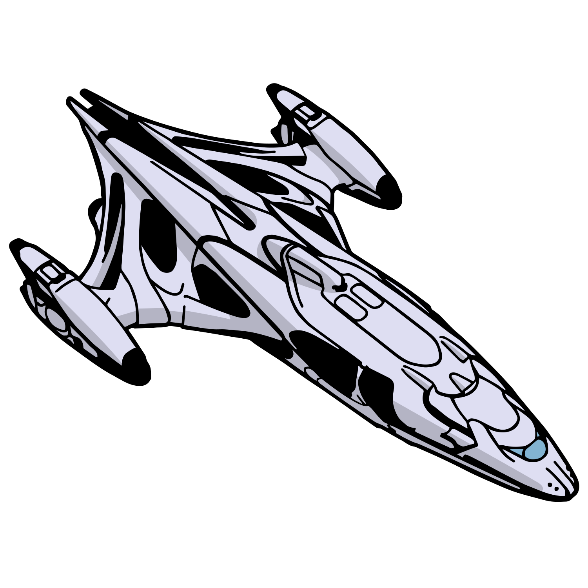

# Overview
## Recommended Progression
|Ship || Cost | Short Description |
|| :-| :-| :-|
|{.image50 loading=lazy}|[:material-information-outline: Viper Mk. 3](../viper3) | 2.41M Cr. | Great Trainer |
|{.image50 loading=lazy} | [:material-information-outline: Vulture](../vulture) | 21.4M Cr. | Strongest small ship |
|{.image50 loading=lazy} | [:material-information-outline: Chieftain](../chieftain) | 81.2M Cr. | Easy strong medium |
|{.image50 loading=lazy} | [:material-information-outline: Anaconda](../anaconda) | 390M Cr. | Best large |

## Together with other great Ships

### Viper Category

|Ship||Notes|
|:-|:-|:-|
|{.image50 loading=lazy}|[:wip: Eagle Mk. 2](../eagle2) | Very agile but also squishy and limited offense. Only slightly cheaper than the Viper Mk. 3 |
|{.image50 loading=lazy}|[:wip: Diamondback Scout](../diamondbackscout) | Similar in stats to the Viper Mk. 3, just more expensive. |
|{.image50 loading=lazy}|[:wip: Viper Mk. 4](../viper4) | Slower and tankier than the others. Not easy to fly. |
|{.image50 loading=lazy}|[:wip: Imperial Courier](../courier) | Can be engineered to be quite fast and have great shields. Requires Rank with the Empire. |

### Chieftain Category

|Ship||Notes|
|:-|:-|:-|
|{.image50 loading=lazy}|[:material-information-outline: Fer-de-Lance](../ferdelance)|High skill floor and ceiling flight model, great hardpoints and very strong shields|
|{.image50 loading=lazy}|[:material-information-outline: Alliance Challenger](../challenger) |Very tanky and great offense.|
|{.image50 loading=lazy}|[:wip: Federal Assault Ship](../assaultship)|Slightly inferior clone of the chieftain. Requires Rank with the Federation.|
|{.image50 loading=lazy}|[:wip: Mamba](../mamba) |Fast in a straight line, but less agile in other aspects. Very good shields, many big hardpoints with bad convergence.|

### Krait Mk. 2 Category

|Ship||Notes|
|:-|:-|:-|
|{.image50 loading=lazy}|[:wip: Krait Mk. 2](../krait2)|A very easy to learn but low potential flight model, however great offensive options, decent defense and the option to carry a fighter hangar.|
|{.image50 loading=lazy}|[:wip: Krait Phantom](../phantom)|Fast lightweight ship (similar flight model to the Krait Mk. 2) with great offensive and decent defensive options.|
|{.image50 loading=lazy}|[:wip: Python](../python)|Not as easy to fly and slower, but tankier.|

### Anaconda Category

|Ship||Notes|
|:-|:-|:-|
|{.image50 loading=lazy}|[:material-information-outline: Anaconda](../anaconda)|Arguably best offense on a large ship, thanks to great convergence, great capacitor and usable agility|
|{.image50 loading=lazy}|[:material-information-outline: Federal Corvette](../corvette)|The unique set of two huge hardpoints offers some fun options, however the positioning of the remaining hardpoints is a bit lackluster. Easiest to handle out of this category. Requires Rank with the Federation.|
|{.image50 loading=lazy}|[:wip: Imperial Cutter](../cutter)|Great hardpoint grouping (for the most part), incredible tank and the option to mount a massive bi-weave. However the lack of turnrate and lateral/vertical thrust makes it annoying to handle. Requires Rank with the Empire.|

## Alphabetically sorted list featuring all Ships ingame
On [:material-information-outline: separate page](../list)

## Remarks
All Builds are provided with one of three game progression stages in mind:

- :material-hexagon: **Basic**: No use of engineering or broker modules
- :material-hexagon-multiple: **Full Engineering**: Use of all relevant engineers and in some instances Guardian Shield Reinforcements

Prices are listed without discounts. Keep in mind that any ship hull and module bought in **systems controlled or exploited by Li Yong-Rui are discounted by 15%**, or 17.1% if the player has at least one elite rank. Setting EDDBs power field is sufficient to guarantee it showing such results only.

Some builds require **disabling cargo hatch (and AFMU) via power priorities**, due to a restrictive powerplant!

In Coriolis, use the **$** symbol (top right) to open a link to EDDB with all modules filled in. In EDSY this function is in the same area, hidden behind the **OPS** button.

Weapon loadouts are often down to preference, experiment with them!