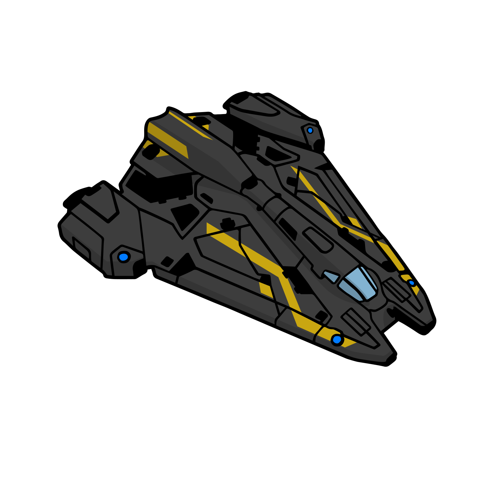

# Viper Mk. 3
{.detailsShipImage}

|Build|Cost|Links||
|:-|:-|:-|:-|
|:material-hexagon: Basic|2.41M Cr|[:material-link: E:D Shipyard](https://edsy.org/#/L=GM00000H4C0S00,Hf500Hf500FBG00FBG00,CEg00CzY00,9on00A5U00AL600Aak00Aoo00B3_00BK400BX_00,13q00,7Py0013q0020m0010i0010i001-C00,PvE_0Combat_0_D_0Basic){target=_blank}|[:material-link: Coriolis](https://coriolis.io/outfit/viper?code=A2p5t5F5l5dasdf2272717170003B42929m32525m1.Iw18UA%3D%3D.Aw18UA%3D%3D..EweloBhAWEoUwIYHMA28QgIwV3fEQA%3D%3D&bn=PvE%20Combat%20-%20Basic){target=_blank}|
|:material-hexagon-multiple: Full Engi|???M Cr|[:material-link: E:D Shipyard](){target=_blank}|[:material-link: Coriolis](){target=_blank}|
|||[:material-link: E:D Ship Anatomy](http://a.teall.info/edsa/?s=viper-mk-iii){target=_blank}|

The **Viper Mk. 3** represents the best cost to performance ratio you can get early on. It has excellent speed, survivability and offensive options compared to its competitors. Its thrust characteristics are particularly strong in lateral and vertical movement and boost efficiency.

**Unengineered** with this ship you should have an easy time dealing with regular assassination missions and fighting in Resource Extraction Sites (excluding 'Hazardous' variety)

Last updated: January 2022
{: .hint }