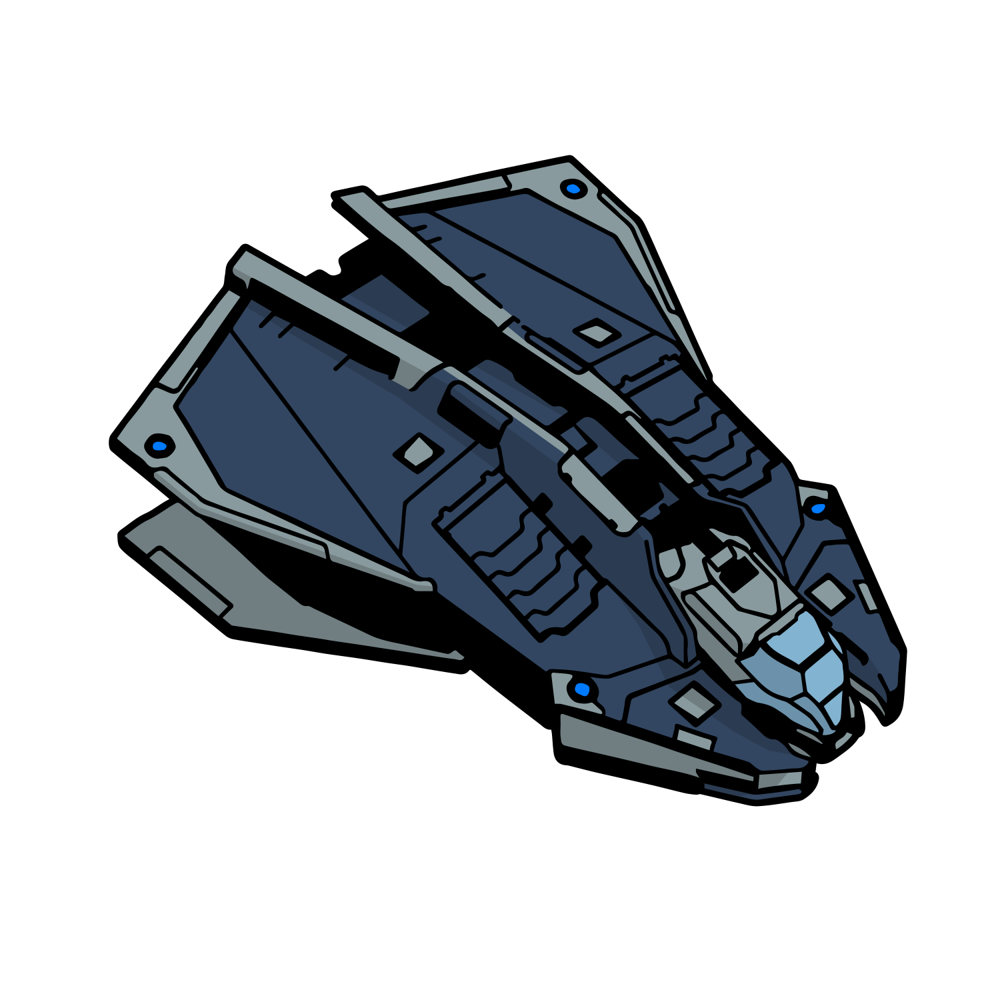

# Vulture
{.detailsShipImage}

|Build|Cost|Links||
|:-|:-|:-|:-|
|:material-hexagon: Basic|21.4M Cr|[:material-link: E:D Shipyard](https://edsy.org/#/L=GN00000H4C0S40,FEE00HgB00,DBw00DBw00CzY00CEg00,9on00A7200AOE00AcI00Aqq00B7600BLe00BZY00,16y00,7T40023u0020m0010i0010i0010i001-C40,PvE_0Combat_0_D_0Basic){target=_blank}|[:material-link: Coriolis](https://coriolis.io/outfit/vulture?code=A2patfFalddksif31d7l04040003B22dm7m3252525m1.Iw18cQ%3D%3D.CwBj4zOI..EweloBhAOEoUwIYHMA28QgIwV3fEQA%3D%3D&bn=PvE%20Combat%20-%20Basic){target=_blank}|
|:material-hexagon-multiple: Full Engi|23.1M Cr|[:material-link: E:D Shipyard](https://edsy.org/#/L=GN00000H4C0SC0,EkgG03P_W0HAwG0BI_W0,DCYG09L_W0DCYG09L_W0DBwG05L_W0CEgG02G_W0,9onG05I_W0A72G074_W0AOEG05I_W0AcIG05J_W0Aqq00B76G03L_W0BLeG05G_W0BZY00,7iMG051_W0,7T4G09L_W07gyG054_W07tn001-C001-C0010iG05I_W010iG05I_W0,PvE_0Combat_0_D_0Full_0Engi){target=_blank}|[:material-link: Coriolis](https://coriolis.io/outfit/vulture?code=A2patfFalddksif3101n08080400B25i5e1Em1m12525.AwRj4yqA.Aw18cQ%3D%3D.H4sIAAAAAAAAA42RvS9DYRTGT1u3%2Bn17q62i6qOXJgbpamIRIiISS0cmC4mBxEBSAzGKiMnQwWgwGoz%2BAIvEYDR0YdGI%2BDiPc27aNxikd3jy3Jzf%2BXyJO4noyxL5PBaJXvuJ4tUYkVMRl7qKErkNHxF8PKlkh5K7IqFbybTLb0D2UXD4OWsqbYrY7juQLnwAmZpNlLuUzOJGt5AB7jXkdov0OqV3MkI%2BSAQWTxhoTyQcYyBy4hANqRtWN6JuVB2CvNLCU8kS0fhsA%2BiZ75dQiJdMpYKItRwmCq49A7mpJ6B4VAcQ5lUDqViVPoEu4jKzN06EZ0z8TO90HpTBF2U7R13uRmq66hBtm4zx9C%2FS1k6p8lYTGrhPCBTnmEIBETrsam6Xr8s%2FErxg8tc1X%2B%2FsaCfXu7PNc%2BbFDkR81RfAezGvfkmLFGuvsn3yB7n%2FL5nmMdPzVLe7E5sYzEtjdSkdwVWHTNsk6O%2F3DZe0yn%2BWAgAA.EweloBhAOEoUwIYHMA28QgIwV3fEQA%3D%3D&bn=PvE%20Combat%20-%20Full%20Engi){target=_blank}|
|||[:material-link: E:D Ship Anatomy](http://a.teall.info/edsa/?s=vulture){target=_blank}|

The **Vulture** is easily the strongest ship that still fits on the small landing pad. It is very maneouvrable with a great mix of vertical and lateral thrust, turnrates and speed. It comes with a massive class 5 power distributor and two well positioned large hardpoints. Backing all this up is the best shield small ships have to offer.

**Unengineered**, the Vulture is just about strong enough to hold its own in Hazardous RES (if you choose your enemies well and do some good flying).

**Fully engineered**, the Vulture is strong enough to even deal with endgame content such as wing assassination missions.

When building on this ship you may often find yourself limited by the small powerplant.

Last updated: January 2022
{: .hint }