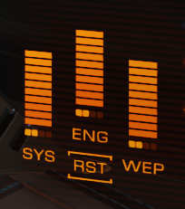

# Pip Management
## What are Pips?

A ship manages power distributor allocation via allocation points (so called "pips"). The ship gets 6 of such points, which can be allocated freely across 12 slots, four each for System (SYS), Engines (ENG) and Weapons (WEP). Each of these energy recipients has its own capacitor, which may store a limited amount of energy for later use. Any pip allocated to a recipient will cause its capacitor to be recharged, scaling linearly. Is no pip assigned to a recipient, then the capacitor does not recharge and if used will eventually drain completely (preventing the use of any equipment which relies on it).

## Deep dive into the energy recipients
### [SYS] General Systems

Energy in this capacitor is used for:

- Shield regeneration
- Activation of utility mounted modules, such as chaff launcher, ECM, scanners, etc.

**Secondary Effect of pips assigned to SYS**: Damage to the ships shield is reduced by up to 60% at 4 pips to SYS, scaling linearly to 0% reduction at 0 pips.

### [ENG] Engines

Energy in this capacitor is used for:

- Engine Boost

**Secondary Effect of pips assigned to ENG**: All aspects of maneouvrability are buffed by pips in ENG, including speed limits, accelerations, rotation speed limits and rotation accelerations.

### [WEP] Weapons

Energy in this capacitor is used for:

- activation of any hardpoint mounted weapon or tool

**Secondary Effect of Energy level in WEP Capacitor**: Weapon heat output is increased when fired at low energy level in WEP Capacitor

## How to manage pips

Your goal as a pilot is to make optimal use of your distributor energy by directing it where it is needed most currently. However it is very important not to neglect secondary effects here. In normal combat engagements this will usually require full pip reassignments atleast every couple of seconds and up to multiple times a second. You need to also think in advance, as it's ideal to start shooting with a full capacitor, and you might anticipate needing a boost.

Check out the [:material-information-outline: Positioning](./positioning.md) section for examples on how to do this.

## Macros

Using simple macros to manage pips is widely accepted as legitimate within the Elite Community, and tolerated by Frontier Developments. A basic yet quite effective macro will assign full 4 pips to SYS/ENG/WEP recipient with a single button press.

[:material-file-download: basicpipmacro.ahk](../files/basicpipmacro.ahk)